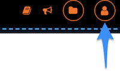
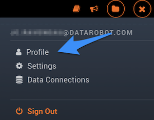
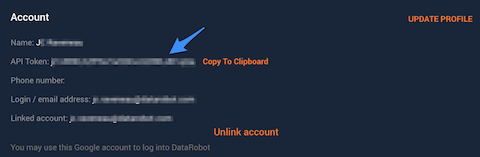
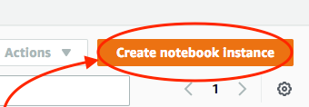
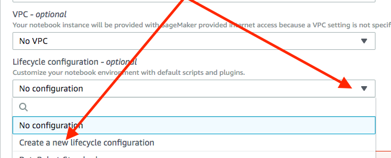
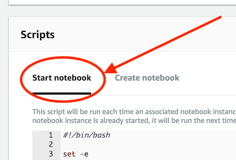
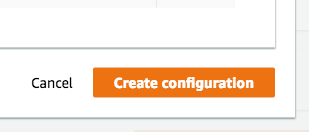
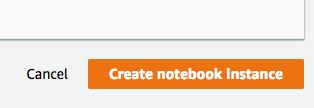

# What is DataRobot

The DataRobot automated machine learning platform helps data scientists and
business analysts discover the best predictive models for every situation,
and then deploy them so they can consistently make smarter and faster
business decisions that impact their company's bottom line.

## Why use DataRobot with SageMaker

DataRobot brings the power of auto-modeling to SageMaker users allowing them
to quickly determine and use the best machine learning model for their
problem. Within minutes DataRobot can iterate on thousands of combinations of
models, data preparation steps and parameters that would take days or weeks
to do manually.

## Before you start: Pre-requisites

To experience the power of DataRobot+SageMaker you’ll need a DataRobot
account. If your company already deployed DataRobot please get an account
from your administrator. Otherwise, please [contact us] here:
[https://www.datarobot.com/contact-us/][contact us]

[contact us]: https://www.datarobot.com/contact-us/

## Getting your DataRobot API Endpoint

1. While logged in the DataRobot interface, click on the _profile_ icon on the top right corner of the screen.

    

2. Select `Profile` from the drop down menu:

    

3. Your API Token will be in the top section of your profile, copy to insert in your notebooks.

    

---

## Overview of Modeling Example

Statistics on whether a flight was delayed and for how long are available
from government databases for all the major carriers. It would be useful to
be able to predict before scheduling a flight whether or not it was likely to
be delayed. In the example notebooks below, we will use DataRobot to try to
model whether a flight will be delayed, based on information such as the
scheduled departure time and whether it rained the day of the flight.

## List of notebooks

>**Before beginning with these notebooks**, make sure you have read through the
[Installing Dependencies](#installing-dependencies) section of this document.

1. [Basic Introduction][1] walks the user through the basics of using DataRobot
   from a SageMaker notebook instance. This includes covering topics such as:
   data preparation, uploading the dataset to DataRobot, kicking off
   auto-modeling and finally getting predictions from the top ranking model.

2. [Diving Deeper into Modeling][2] shows the user how to explore the models
   created by the auto-modeling process in more detail. For example, we will see
   how the models are performing against the training data.

3. [Exploring Reasons for Prediction Results][3] examines enhanced
   functionality supported by DataRobot to provide more insights into prediction
   results. For certain project types, DataRobot supports producing explanations
   about a its prediction output on a per-row basis.

[1]: Basic%20Introduction%20to%20DataRobot%20via%20API.ipynb
[2]: Diving%20Deeper%20into%20DataRobot%20Models.ipynb
[3]: Working%20with%20DataRobot%20Reason%20Codes.ipynb

## Installing Dependencies

To use these notebooks we require extra dependencies to be installed into the
_Notebook Instance_. While it is possible to install packages directly inside
the running Jupyter instance, this is not ideal as everytime the instance
is restarted, all modifications will be lost. To better support customization
of the Notebook Instance environment Amazon provides [Lifecycle Configurations],
which is a shell script that can be configured to run each time a notebook
instance runs. To learn more, see Amazon's [documentation][Lifecycle Configurations]
or their [blog][lifecycle blog] post on the subject.

[Lifecycle Configurations]: https://docs.aws.amazon.com/sagemaker/latest/dg/notebook-lifecycle-config.html
[lifecycle blog]: https://aws.amazon.com/blogs/machine-learning/customize-your-amazon-sagemaker-notebook-instances-with-lifecycle-configurations-and-the-option-to-disable-internet-access/

### Create Notebook Instance

Below we provide some simple steps on how to create a new notebook instance with
a lifecycle configuration that will prepare the instance to work with DataRobot. Unfortunately,
it SageMaker **does not** allow you to attach a lifecycle configuration to an existing
notebook instance so we will launch a new one:

1. Click the `Create notebook instance` button

    

2. Fill in all the appropriate fields until you get to the `Lifecycle
   configuration` drop-down and select `Create a new lifecycle configuration`
   and this will pop open a new modal panel

    

3. Give the configuration a descriptive name (e.g. _DataRobot-Standard_) and
   then click on the `Start notebook` tab under the _Scripts_ section:

    

4. Paste the script below into the script editor:

```bash
#!/bin/bash

set -e
export PATH=/home/ec2-user/anaconda3/bin/:$PATH

# Install DataRobot client package for Python 2
conda install -n python2 -c conda-forge datarobot -y -q

# Install DataRobot client package for Python 3
conda install -n python3 -c conda-forge datarobot -y -q
```

<!-- markdownlint-disable MD029 -->
5. Click the `Create configuration` button at the bottom of the page to save
   a new Lifecycle Configuration.

    

5. Finish filling in the rest of the options for your instance and click the
   `Create notebook instance` button at the bottom of the page to begin
   launching your new instance.

    

---
In the future, if you need to launch new notebook instances, you can reuse
the Lifecycle Configuration created in the steps above rather than creating a
new configuration. Note, scripts cannot run for longer than 5 minutes. If a
script runs for longer than 5 minutes, it fails and the notebook instance is
not created or started.
